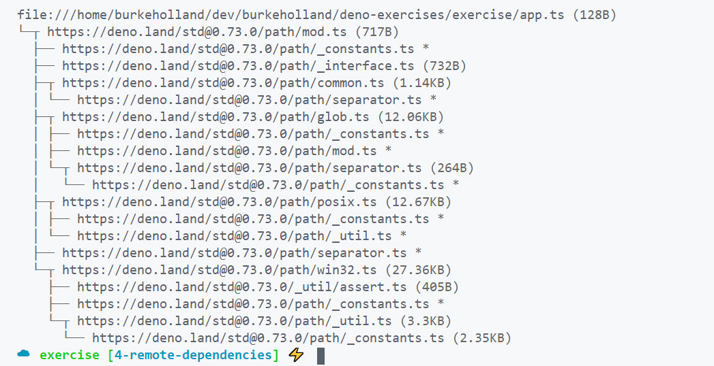

> Make sure you are on the [4-remote-dependencies](https://github.com/burkeholland/deno-exercises/tree/4-remote-dependencies) branch to follow along with this section.

"Remote" dependencies are how Deno handles what you would know today as "npm" packages. These are libraries that you might consume and use that someone else has written.

Deno maintains a list of [approved third-party modules](https://deno.land/x) on their site. In fact, we'll use some of them later in this course.

Deno also has a "Standard Library" that you will probably use quite a bit. These would be modules that are considered "built-in" by Node.

For instance, Node has a "path" module that is frequently used. If you wanted to get the file name from a path, you could use the `path` module and `basename` method.

```javascript
const path = require("path");

console.log(path.basename("/files/folders/folder/file.txt"));
```

The Deno standard library also has a "path" module. In Deno, the exact same functionality looks like this...

```typescript
import * as path from "https://deno.land/std@0.73.0/path/mod.ts";

console.log(path.basename("/files/folders/folder/file.txt"));
```

> You'll see this "mod" file name a lot in Deno. It's the standard way of naming modules. It's short for "module". It's not required by Deno, it's just the standard naming they use.

Both of these do the exact same thing and return the exact same result. The big difference is that you had to include the module by URL.

- Run the second one in the `app.ts` file
- Notice the output...

```bash
Check file:///home/burkeholland/dev/burkeholland/deno-exercises/exercise/app.ts
file.txt
```

Deno downloads all of the dependences specified in the `mod.ts` file which we imported to get the whole path module.

Let's examine again what happened here by navigating to the generated output for the project...

Linux

```bash
~/.cache/deno/gen/file/<path-to-deno-first-look-exercises>

// on my machine, it looks like this...
~/.cache/deno/gen/file/home/burkeholland/dev/deno-first-look-excercises
```

Windows

```powershell
C:\Users\burkeholland\AppData\Local\deno\gen\file\<path-to-deno-first-look-exercises>

// on my machine, it looks like this...
C:\Users\burkeholland\AppData\Local\deno\gen\file\C\dev\burkeholland\deno-first-look-exercises
```

The `app.ts` file now looks like this...

```javascript
import * as path from "https://deno.land/std@0.73.0/path/mod.ts";
console.log(path.basename("/files/folders/folder/file.txt"));
//# sourceMappingURL=data:application/json;base64,eyJ2ZXJzaW9uIjozLCJmaWxlIjo...
```

But we know that Deno doesn't download that file every time we run the program. We know that the first time we try and use it, Deno downloads it to the "deps" cache.

Linux

```bash
~/.cache/deno/gen/file/<path-to-deno-first-look-exercises>

// on my machine, it looks like this...
~/.cache/deno/deps/https/deno.land
```

Windows

```powershell
C:\Users\burkeholland\AppData\Local\deno\deps\https\deno.land

// on my machine, it looks like this...
C:\Users\burkeholland\AppData\Local\deno\deps\https\deno.land
```

The "deps" cache now contains a bunch more files. These are the dependencies that were downloaded to your machine. This is the equivalent of an "npm install". Deno uses the metadata files to find the dependencies you need right on your own machine. It won't try and download these again unless you change the version or force an update.

But how do we know what dependencies were installed? This is where the info command comes in again.

We can run `deno info app.ts` and it will show us a tree of the dependencies that the "path" mod from the Standard Library pulled in.



Now let's take a moment and address the elephant in the room - which is that importing modules from URL's feels... completely nuts.
