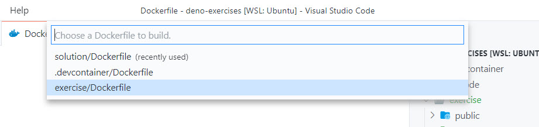
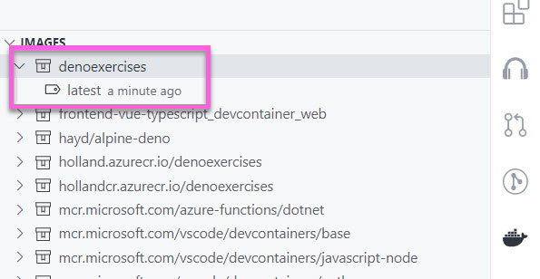

> Make sure you are on the 8-containerize branch to complete this section.

## Prerequisites

In order to complete this section, you'll need the following installed...

- [Docker Community Edition](https://docs.docker.com/get-docker/)
- [Docker extension for VS Code](https://marketplace.visualstudio.com/items?itemName=ms-azuretools.vscode-docker&WT.mc_id=devcloud-0000-buhollan)

A Deno application can be deployed to production in 2 different ways - bundled and unbundled. While there is a long-term goal (and open issue) for compiling to an ".exe" at some point in the future, we are not there yet. It should be noted that Ryan stated this goal in his "10 things I regret about Node" talk as well.

Whether you deploy an application bundled or unbundled, the way that you run it is the same as how you run it in development. For instance, we've been running our Oak web project so far with...

```bash
deno run -A --unstable app.ts
```

That same line will be how you run it when you deploy it. Just like any application, you basically have 3 options for deployment with Deno...

1. Your server (or VM)
1. A PaaS
1. A Container

Of course, you can always run anything you like on your own server or a server/VM you rent from a cloud hosting provider (hopefully Azure, but you do you).

A PaaS is short for "Platform as a Service". A PaaS is a hosting provider where you only provide your code. They provide the runtime and handle starting and stopping your application. Heroku is probably the best known for this, although you can find them on Azure App Service, Google Cloud Platform and Amazong Web Services as well.

Nearly all of these PaaS providers will allow you to run your Deno app on their PaaS. You can find docs for Heroku, Azure and I'm sure many others. Since each one of these is specific to the hosting platform and not to Deno, I'd like to instead focus on something a bit more generic, and that's containers.

## Running Deno in Docker

Containers are magical for web applications because they allow you to define a runtime environment for your application and then just deploy that whole thing. You don't have to worry if Deno is or isn't installed on the server because it's in your container already. Let's take a look at what it takes to get a Deno container running. If you haven't used Docker or containers before, I highly recommend watching Brian Holt's ["Complete Intro To Containers" course](https://btholt.github.io/complete-intro-to-containers/intro).

First, create a file in the root of the "exercise" folder called "Dockerfile". This file will be where we define how the container will be built and how the code will be executed in it.

We need a base image to start from - one that has Deno in it. While Deno [doesn't yet have an "official" image](https://github.com/denoland/deno/issues/3356), most people are using an image called "hayd/docker-deno", so that's what we'll be using here. Add the following line to the top of the Dockerfile to pull in that image.

```dockerfile
FROM hayd/alpine-deno
```

This image contains not only Deno, but all of the deno environment configuration that we would normally need to do to get autocompletions and the like. It also contains a default user called "deno" so that your application doesn't run as root with too many privilages.

Now that we've got that image, we need to define our workdirectory - or rather - the directory where our application is going to go inside the container. You can call it anything you like. I usually just call it, "app".

```dockerfile
FROM hayd/alpine-deno

WORKDIR /app
```

We need to specify a port for the application to run on. This is important to do because when we deploy it, the hosting provider is going to be mapping this port to some random external port so the app is exposed to the internet. We'll use port 8000 here as to be doubly sure that you don't conflict with the previous exercises which you still may have running on your machine on port 3000.

```dockerfile
FROM hayd/alpine-deno

WORKDIR /app

ENV PORT=8000
```

Now we need to copy in the application.

```dockerfile
FROM hayd/alpine-deno

WORKDIR /app

ENV PORT=8000

COPY . .
```

Next, run the application with the `CMD` command. This will be what actually executes when your Docker container is started.

```dockerfile
FROM hayd/alpine-deno

WORKDIR /app

ENV PORT=8000

COPY . .

CMD ["deno", "run", "-A", "--unstable", "app.ts"]
```

Finally, expose the port 8000 so that the application can be accessed.

```dockerfile
FROM hayd/alpine-deno

WORKDIR /app

ENV PORT=8000

COPY . .

CMD ["deno", "run", "-A", "--unstable", "app.ts"]

EXPOSE ${PORT}
```

OK! Not too bad. Let's just recap what's happening here...

1. A default image is pulled that already has Deno installed
1. The working directory is specified
1. The PORT environment variable is specified
1. We copy our code into the container
1. We specify the command that runs our program
1. We let Docker know to expose port 8000 by exposing the value of the PORT variable

Let's build the container.

### Building the container

Open the VS Code Command Palette and select "Docker Images: Build Image". Select "exercise/Dockerfile".



Take the default name and tag (denoexercises:latest) and press enter. The container should be built and you'll see the output in VS Code.

Open the Docker Explorer in VS Code and you should see the image at the top of the "images" section...



Right-click the "latest" image and choose "Run Interactive".

Your terminal should show Deno downloading all of the dependencies in the container, checking the "app.ts" file and then a glorious...

```bash
Now listening on http://0.0.0.0:8000
```

Now open your browser and see if you can access the application running on port 8000.

Awesome! Now that you have a container, you can deploy it anywhere containers can run. Which is pretty much everywhere. In the next section, we'll do just that.
