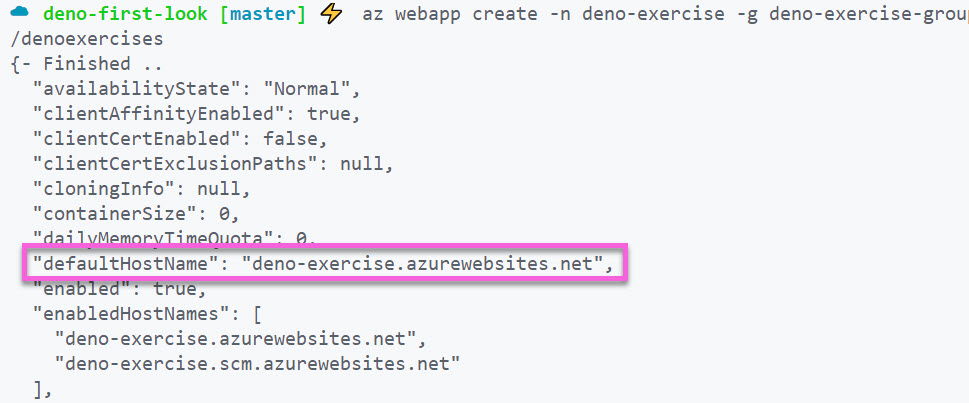
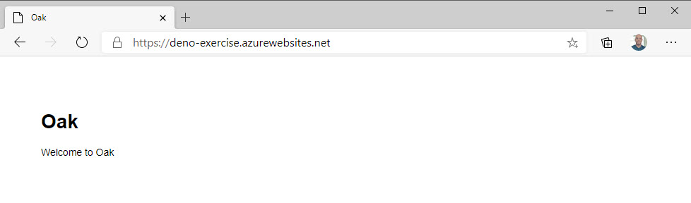

## Prerequisites

To complete this section, you'll need the following things...

- [Azure CLI](https://docs.microsoft.com/cli/azure/install-azure-cli?WT.mc_id=devcloud-0000-buhollan)
- [Free Azure Account](https://azure.microsoft.com/en-us/free/)

> Make sure you are on the "deploy-container" branch before continuing.

Now that we've pushed the image to Docker hub, we can pull it in from a cloud hosting provider. Nearly all providers support containers. For the purposes of this section, we'll be using Azure.

## Creating the site

The Azure Service that we need to host a website in a container is called "App Service". App Service allows you to host a container in Azure with your website inside.

Using the Azure CLI, make sure you are logged in...

```bash
az login
```

Next, create a Resource Group. Resource Groups are just how Azure resources are organized. You can think of them like projects. A project might have a database, a website, some analytics - all of those are different Azure services, but we would want them all in the same resource group to help us stay organized.

```bash
az group create -l westus -n "deno-exercise-group"
```

Now we need to specify what sort of computing power we want for the site we're going to create. That's done with something called "service plans". A service plan says what kind of operating system you want - Windows or Linux - and how much compute you need. This is where you are spending money in so much as you get what you pay for. For this demonstration, we'll use the F1 - which is the free tier. Finally, we're specifying that we want Linux hosting as Windows is the default.

```bash
az appservice plan create -g deno-exercise-group -n deno-service-plan --sku F1 --is-linux
```

Last, we create the site and tell it to pull our image from Docker hub.

```bash
az webapp create -n deno-exercise -g deno-exercise-group -p deno-service-plan -i burkeholland/denoexercises
```

> Web app names in Azure have to be unique, so if the command fails, try a different name than "deno-exercise".

Let's just review what all those flags were, cause there are a few of them...

- -n = name of the web app
- -g = name of the Resource Group
- -p = name of the Service Plan
- -i = name of the image to pull and run

It takes just a minute for the site to start the container for the first time. You can find the URL for your new site by looking at the output from the last command (there is a lot of it - I know) and finding the "defaultHostName" property...



Copy that URL and paste it into a browser tab and...



Rock and roll! We successfully built a full-on web app with Deno and deployed it to a proper cloud.
