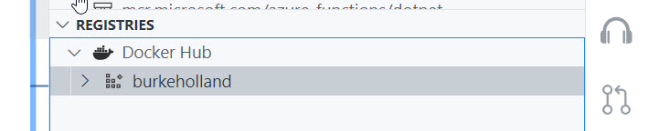
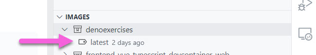
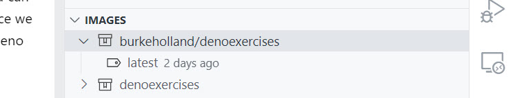
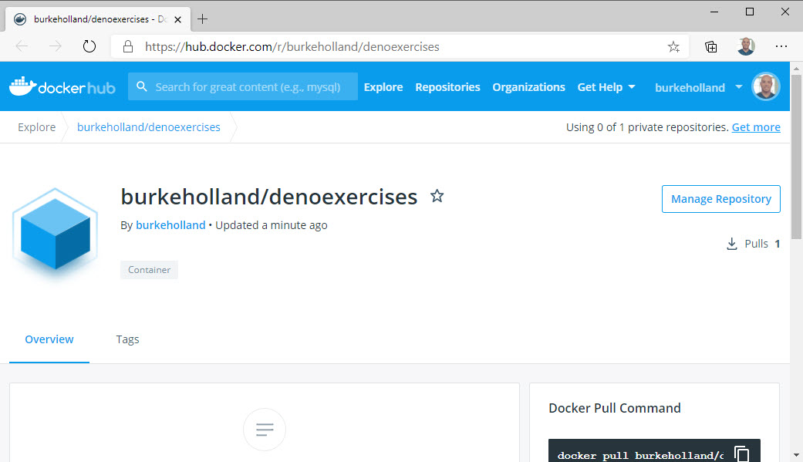

## Prerequisites

To complete this section, you'll need the following things...

- Azure CLI
- Docker Extension for VS Code
- An Azure Account

Containers can run pretty much anywhere these days. You can run them on your own hardware, or you can send one up into the cloud and run it there. Since we don't have a data center, we'll be sending our Deno container up to the cloud.

We could push to Dockerhub, Azure, Gitlab - anywhere that provides a container registry. Dockerhub is probably the most commonly used registry, so we'll push our image there, and then pull it into a hosting provider

## Pushing the image to a registry

First we need to push our image to a registry. In the "Registries" section of the Docker Explorer, click the "Connect Registry" link to connect to a registry.

Select "Docker Hub" from the list. You'll need to sign in with your Docker username and password. Once you do that, you'll see your username under the Docker Hub item in the explorer view.

To push the Deno image to dockerhub, we need to tag it with the registry name. In my case, the registry name is "burkeholland".

In the "Image" explorer, find the "denoexercises" node with the "latest" image.

Right-click this image and select "Tag". Tag is by putting your registry name in front of the image name.

You should now see a second image in the explorer that contains the newly created tag.

Right-click the "latest" image under <username>/denoexercises and select "Push".

Take the default tag (we've already tagged it) and press enter.

The terminal should open and you'll see your image being pushed up to Dockerhub.

Go back to the "registries" view and expand your username node. You should see the newly created image in the list. Right-click it and select "Open in Browser". This will take you to your image on Dockerhub.

The image has now been published to Dockerhub. This means that we can pull it with a hosting provider and see our app running in production.
