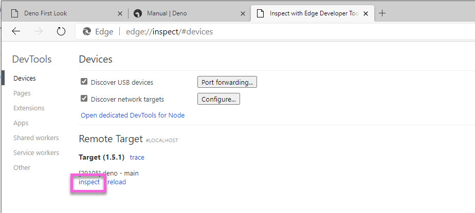
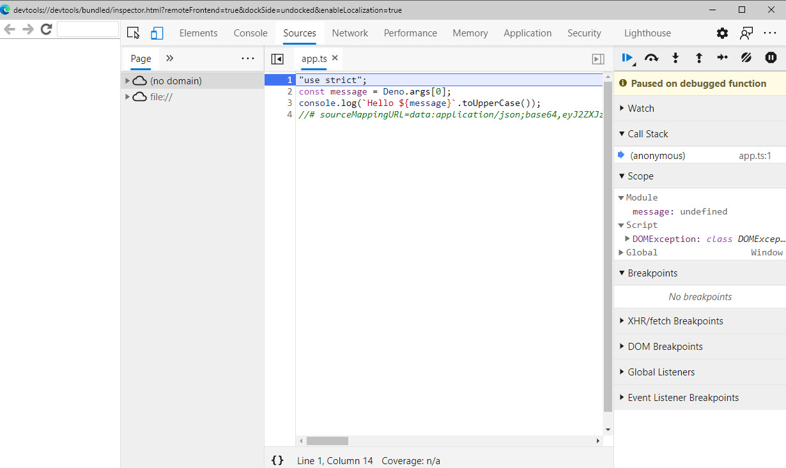
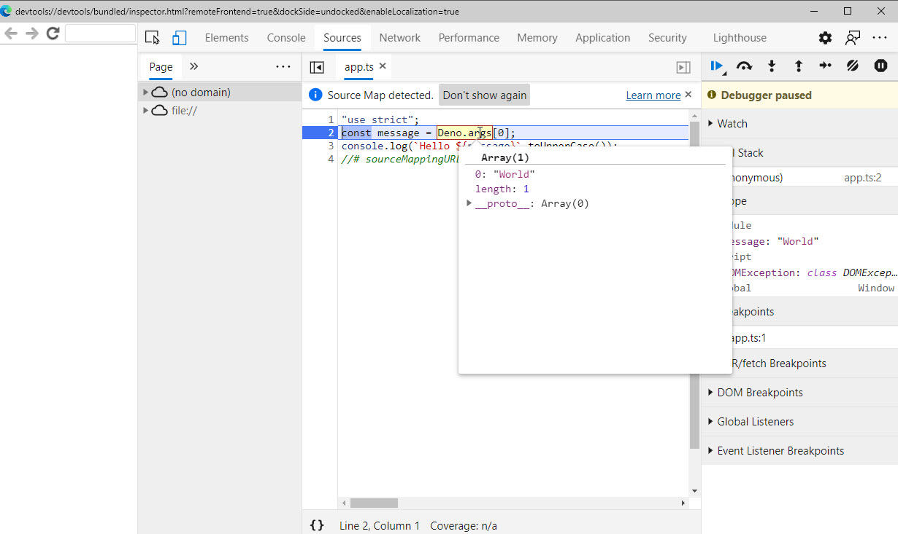
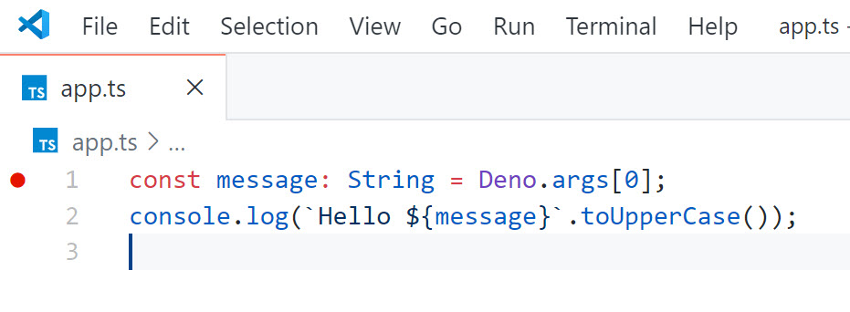
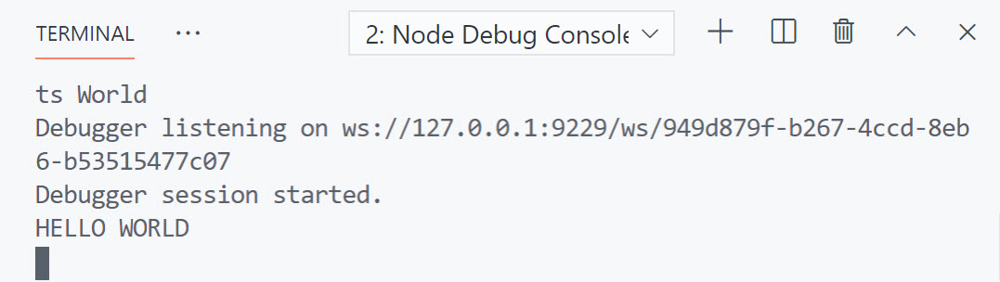

> Make sure you are on the "3-debugging" branch in the "exercise" folder to follow along with this section.

Deno apps can be debugged either from the browser, or with VS Code. Much like Node, Deno has `--inspect` and `--inspect-brk` flags. The `--inspect` flag starts the program and listens for the debugger. The `--inspect-brk` does the same thing except that it automatically breaks on the first line of the program.

When a process is in debug mode, you can attach to it with browser dev tools to provide a robust debugging experience.

## Using the browser dev tools

This should work in any Chromium based browser - including Chrome itself and Microsoft Edge.

First, make sure the `app.ts` file contains the following code as we left it in the last module...

```typescript
const message: String = Deno.args[0];
console.log(`Hello ${message}`.toUpperCase());
```

Run the program as you normally would, but this time, pass in the `--inspect` flag

```bash
deno run --inspect app.ts World
```

Passing the `--inspect` flag opens the debugger port. However, the program runs to completion and you don't have a chance to debug it. This is because you haven't set any breakpoints and your code has no errors. The solution to this is to use the `--inspect-brk` flag instead.

Run the program again, this time passing in the `--inspect-brk` flag...

```bash
deno run --inspect-brk app.ts World
```

This time, the program runs, and then pauses. Now you can attach your browser developer tools to the running program.

## Attach with browser dev tools

> Note that this requires a Chromium-based browser such as Chrome or Edge

All you need here is an open browser tab. Navigate to `chrome://inspect` or `edge://inspect`. Both will work. In Edge, typing `chrome://inspect` will take you to `edge://inspect`.

The browser should automatically see your running program and list it as a "target" as shown below. Click the "inspect" link.



This will open the browser dev tools and you will see the your program is broken on the first line...



Step over to the next line and hover over the `Deno.args` object. You can see the "World" argument that was passed in.



Click the continue button to finish execution and then close the Dev Tools.

> Noe that at the time of this writing, this does not work with WSL2 as Chrome/Edge looks for Deno source code in //home/, which is not a valid path on Windows.

## Debugging with VS Code

The Deno extension for VS Code includes a debugger. It also knows how to automatically configure a `launch.config` with the correct settings to launch the program with `--inspect` and attach the VS Code debugger.

- Press <kbd>F1</kbd> to open the Command Palette in VS Code
- Type "launch" and select "Open launch.json"
- Select "Deno"

VS Code creates a launch configuration and adds a file called `launch.json` and a folder called ".vscode". By default, the configuration looks for a file called `main.ts`. But in the exercise, we have called the file `app.ts`. Modify the `launch.config` file so that the `program` is `app.ts`.

```json
...,
"program": "app.ts",
...,
```

- Open the `app.ts` file
- Click in the gutter next to line 1 to add a breakpoint. A red circle should appear next to the line.



- Press <kbd>F5</kbd> to start the application.
- The application breaks on the line where you breakpoint is.
- Mouse over the Deno.args object to see the arguments that were passed in. There are none! This is because the debugger is launching the program and you need to pass the argument in there.

- Press the stop button in the debugger to stop the process.

- Open the `launch.json` file and add an "args" property underneath the "runtimeArgs" section.

  ```json
  "args": [
      "World"
  ],
  ```

> Note that if you added "World" to runtime args, it would be passed BEFORE the name of the file to execute (app.ts) and the command would fail.

- Press `F5` to run the application again.
- Notice that `Deno.args` now contains "World".
- Press the continue button to finish execution and close the debugger

Notice that you can't see any output. Why is that? Where is the "Hello World" being logged out to?

By default, VS Code runs terminal apps on in internal console that you cannot see. You can alter this by specifying the "console" property in the `launch.config` file. Set it to "integrated" to see the output in the VS Code terminal.

```json
"args": [
    "World"
],
"console": "integratedTerminal",
```

- Press <kbd>F5</kbd> to run the application again.
- Press the "step over" button in the debug bar.
- "Hello World" is written to the Integrated Terminal.


