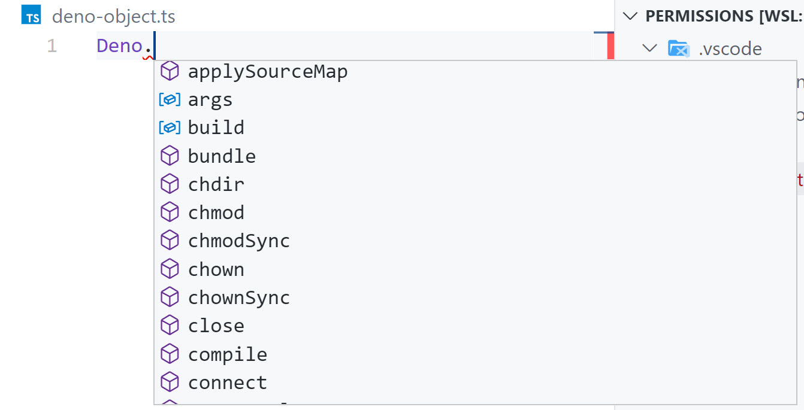

> Make sure you are on the ["3-the-deno-object"](https://github.com/burkeholland/deno-exercises/tree/3-the-deno-object) branch to follow along with this section.

Just like a browser has a top-level "window" object, Deno has a top level "Deno" object. Much of the functionality that you would expect to find in certain Node modules is built in to this global object.

## Inspect the Deno object

In VS Code, type `Deno` and then hit the `.`. The intellisense should come up. Use the arrow keys to cycle through the list of items that are on the Deno object.



Notice that most of these methods are for interacting with the system. This includes thins like `chown` for changing file permissions, and the APIs for creating file, reading files and writing to files.

Deno also has a standard library that you can import as a dependency. This can be confusing. It can be hard to know what functionality is on the Deno object, and what you might need the Standard Library for.

As a good rule of thumb, look on the Deno object before you look in the Standard Library. Most of what you need can be found without a dependency.

## Deno object replacement for Node concepts

The Deno object replaces many of the concepts that you'll find in Node in various places.

### args

Node.js has the `process.argv` object. This returns every argument on the terminal - including "node", the path to the file being executed and every argument after that.

Deno has an "args" object which contains an array of _just_ the arguments.

Add the following code to "app.ts"

```typescript
console.log(Deno.args);
```

Execute the program and pass in some arguments

```bash
deno run app.ts Hello World 1 2
[ "Hello", "World", "1", "2" ]
```

### env

In Node.js, you access environment variables by looking at the `process.env` object.

In Deno, the `process` object does not exist. Instead, look on the `Deno.env` object.

Add the following to the `app.ts` file

```typescript
console.log(Deno.env.get("DEVELOPMENT"));
```

Execute the program from the terminal, passing in the environment variable the same way you normally would in Node.

```bash
DEVELOPMENT=true deno run app.ts
```

The command fails! And this is your first look at "Secure By Default". You cannot read env variables without explicitly giving the program permission to do so.

```bash
DEVELOPMENT=true deno run --allow-env app.ts
```

The program runs and returns "true".

### \_\_dirname

In Node.js, there is a `__dirname` constant that tells you what the full path is to the current directory.

In Deno, this constant doesn't exist. Instead, you'll use the `Deno.cwd()` method, which returns the same value as the `__dirname` const.

Replace the code in `app.ts` with the following...

```typescript
console.log(Deno.cwd());
```

Execute the file from the terminal

```bash
deno run app.ts
```

Failed again! You cannot read the file system without specific access. Pass in the "--allow-read" flag.

```bash
deno run --allow-read app.ts
```

The program runs and should return the path to the current directory.

You've seen what you can do in Deno with just the `Deno` object. It's important to know that the Deno object has many options as you can look their first before you think you might need a dependency to do something.
