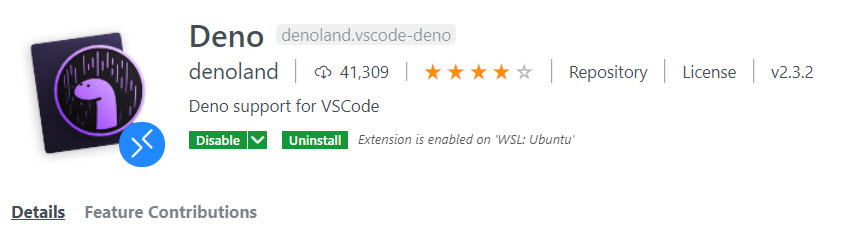
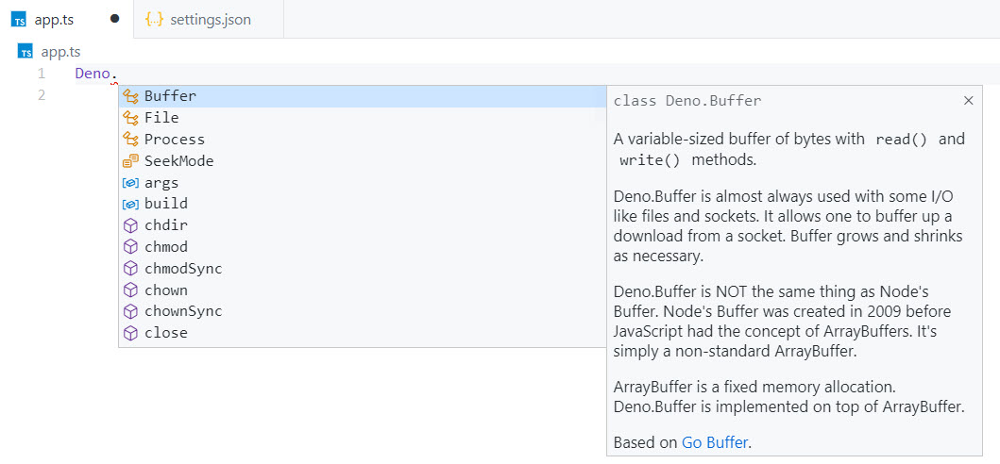

Tooling is available for Deno in the form of the Deno VS Code extension. The primary value of the extension is that it provides intellisense for Deno and a debugger.



The extension is installed from the VS Code Extension gallery either through VS Code, or via the [extension gallery web site](https://marketplace.visualstudio.com/items?itemName=denoland.vscode-deno).

By default, the extension won't appear to do anything. This is because it is disabled by default. You'll need to enable the Deno extension for your Deno code by adding the following line to your **Workspace** settings. Workspace is bolded there because that is what Deno recommends that you do, and at the time of this writing, enabling it in your user settings appears to have no affect.

```json
"deno.enabled": true
```

Once you change this setting, reload the editor by selecting "Reload Window" from the Command Palette in VS Code. I have been unable to get the extension to work without doing this after first install. There may also be occasions where the extension stops working. In this case, a "Reload Window" usually solves the problem.

To test that the extension is working, create a new file in the "deno-first-look-exercises" project called "app.ts". Type the "Deno" global variable and press the ".". This should trigger VS Code's intellisense, which will show you all of the methods available off of the global "Deno" object.



Great! You've got Deno installed and you've got the tooling that you need. It's time to write our first program using Deno.
