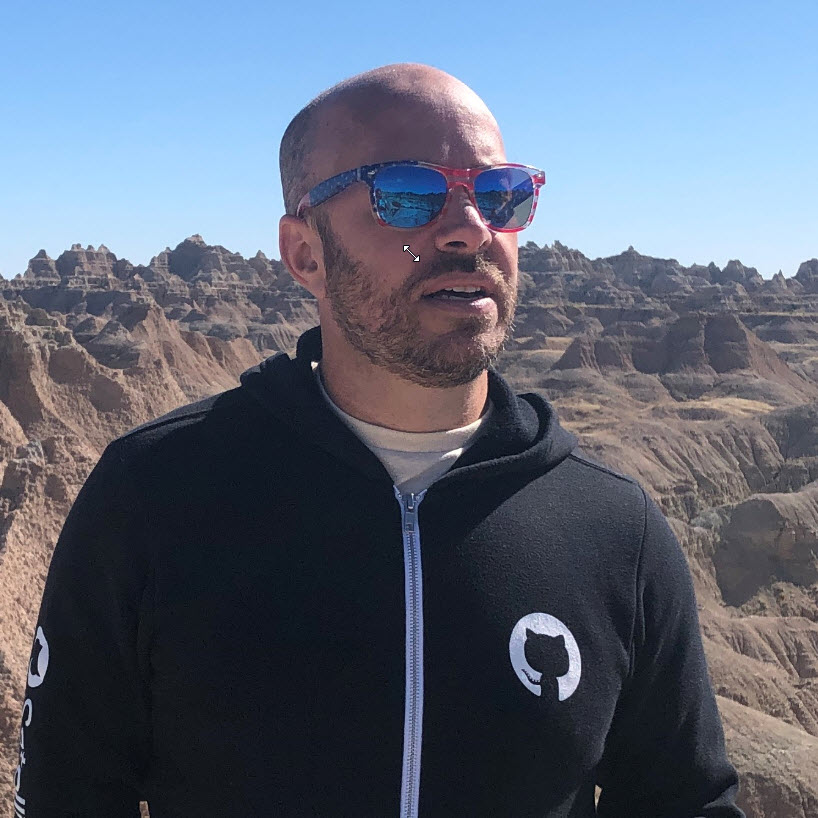
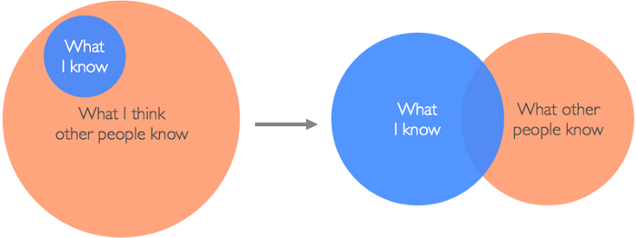

Welcome to Deno First Look! 🎉

## Course Objective

The objective of this course is to help you understand what Deno is, why on earth we need yet another JavaScript runtime (Isn't Node.js good enough?) and how to build applications with Deno. Depending on when you see this, Deno may or may not have gained enough popularity in the JavaScript community to be prolific. The truth is we just don't know if it will. But going through this course will ensure that you are not caught on your heels if it does. And either way, it just might open your mind to considering a different JavaScript runtime than what you may be used to.

## Who Are You?

You should be a JavaScript developer with knowledge of Node.js. It's likely that if you're doing JavaScript development these days, that's a given. Node.js is used by most people in at least a development capacity - running local web servers, linting tools, ect. If you are using Node.js in production to host applications such as websites, services, microservices, ect, then this course is especially applicable to you. Many of the exercises we'll go through in this course will specifically compare to functionality or libraries that exist today in Node.

TypeScript is also a plus, but not required. We don't spend a lot of time getting into types or messing with TypeScript paticulars like interfaces, modules or the compiler details. There is quite a bit of that in Deno, but my feeling is that it adds a layer of confusion that isn't necessary to understand and be productive with Deno. It's also extremely off-putting if you don't know TypeScript, and I don't want to put you off. I want to excite you.

If you would like to get a general knowledge of what TypeScript is, refer to [this video](https://channel9.msdn.com/posts/Anders-Hejlsberg-Introducing-TypeScript), which should be sufficient knowledge for this course. Normal JavaScript works just fine in TypeScript, and Deno supports both so I wouldn't worry too much about it.

## Where To File Issues

The last time I did a course, I got a lot of PR's on mistakes made throughout. Most were grammatical or wrong images. There was a lot of misuse of "it's" vs "its". English is hard. Furthermore, my attention to detail isn't what it should be. What I'm trying to say is that mistakes in this course are inevitable, and I know that you will see what I cannot. If you do, I would love it if you would [open a pull request](https://github.com/burkeholland/deno-first-look/pulls) or [file an issue](https://github.com/burkeholland/deno-first-look/issues) on the GitHub repo. You can always find me on Twitter as well, although I try to avoid social media because I want to be happy so replies will be _seriously_ delayed.

## Who Am I?

My name is Burke Holland, and I am a Content Engineer at Microsoft, where I do advocacy around GitHub, VS Code and all things JavaScript. I also have a cursor on my face.

I work with a team of great people and together we try and make Microsoft tools, services and runtimes the best place in the world for JavaScript developers. I've been a JavaScript developer for 12 years. That's a long time in the world of JavaScript. I first fell in love with it when jQuery came out, and I have never looked back. I love everything about JavaScript, and I've never tired of writing it. I think it's a magical language that is uniquely easy to get started with and bizarrely well suited for applications of all types.

I love teaching because it's simply the best way to learn something. It also lets me connect with people and through this I have learned that we are all far more alike than we are different. Mainly, we are all learning, and nobody has it all figured out. If you feel like you are the only one who doesn't understand things, let me assure you, you are not. There are at least 2 of us, and I am one. I love this diagram. I think it says it all.

_Image Credit:_ [Alica Liu](https://medium.com/counter-intuition/overcoming-impostor-syndrome-bdae04e46ec5)

I live in Nashville with my wife, 3 teenage boys and 2 pugs. I'm a huge fan of Overwatch and I main Wrecking Ball. I know a lot of people don't like Wrecking Ball and they tell me all the time when we lose. I'm also an amature craftsman, having built several pieces of modest furniture and doing remodel projects when my wife has new ideas for the house. There is a lot in common with woodworking and coding. Or knitting and coding. If you like coding, try picking up a different craft. Because you _are_ a craftsman.

If you'd like to connect, you can [find me on Twitter](https://twitter.com/burkeholland). Although I treat Twitter kind of like Walmart - I only go in if I absolutely have to, so a better place to catch me is to [email me directly](mailto:burkeholland@gmail.com). I'd love to hear from you!

## Why Was This Course Created?

I think the key to staying sane in this industry is to always be open to learn new things. It's also good to learn to learn-and-forget. You'll pick up things that stay with you and pay dividends down the road. Deno may be ripple in a vast and endless ocean of JavaScript projects, libraries and frameworks. Or it may become the ocean itself. We don't know and that can cause distress. Learning about something removes the fear and intimidation that causes us to avoid things. This is true for everything in life, not just technology. Try it out and you'll see what I mean. If something scares you, learn more about it and will lose it's power.

There is also no idea that should be off the table when it comes to technology. Let's look at them all and pick the ones that work best for you, your brain, your team and your project.

I have a [Frontend Masters course on VS Code](https://frontendmasters.com/courses/customize-vs-code/) as well if you'd like to check that out. That's a completely free course available to everyone. No subscription required.

Thanks for staying with me, and I hope you enjoy this course: Deno First Look.
