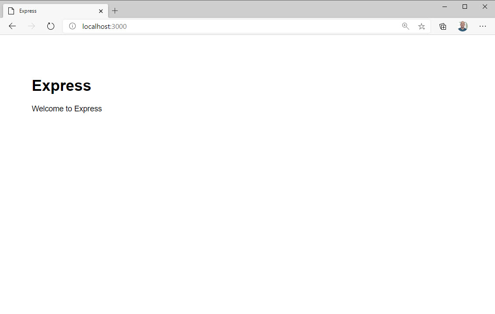
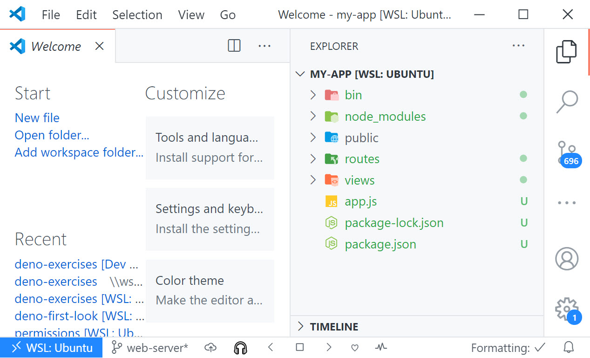
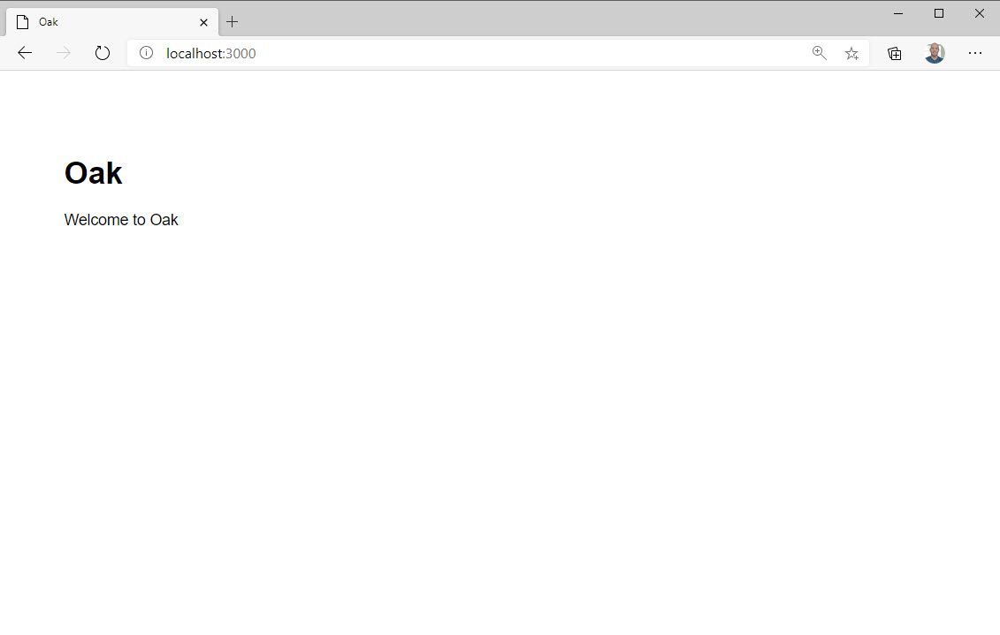

Just like Node.js has the Express web framework, Deno has a web framework as well. It's called Oak. And since Deno loves anagrams, Oak is an anagram for Koa. Koa is a web framework for Node built on the concept of generators. It's not as popular as Express given that generators haven't taken off syntactically. You might not agree with that statement, but I think it's objectively obvious that we don't see generators in much of the JavaScript code out in the wild. Or maybe you see them. But I don't.

While Oak is modeled after Koa, it's more useful to compare it to Express because that will be the paradigm that more developers are familiar with, and that's definitely true for _this_ developer.


Oak is modeled after Koa and Koa is the successor to Express. Given all of that, the syntax for Oak looks a lot like the syntax for Express. The big difference is that Oak does not come with all of the baked-in middleware that Express does. Middleware is code that executes on the request to the server. Middleware can do all sorts of things, from providing templating to handling cookies and so on and so forth.

Express also provides a nice scaffolding tool that has made it's adoption rather quick. This generator scaffolds out an opinionated folder structure that helps get you moving in the right direction.

In this next section, we're going to build an opinionated project structure for Koa that mimics what you get today with Express. Before we do that, let's look at what Express does today.

## Generating an Express app

Generate a new Express App with Handlebars template support

```bash
npx express-generator --hbs my-express-app && cd my-express-app && npm i
```

Open the application in your editor

Run it from your terminal with `npm start`.



Examine the project in your editor



- Examine the `app.js` file. Note that Express puts all of it's application setup logic in the `app.js` file.
- Examine the "views" folder. Note that there is a layout, index and error template.
- Examine the "routes" folder. Note that the specific route logic is handled in these files
- Examine the "public" folder. Note that any files that are placed in this folder can be referenced in the template files via the "public" relative URL.
- Examine the "bin" folder. Note that the `www` file contained inside is the entry point of the application.

We're going to replicate this exact same application setup and build this same default Express app with the Oak framework. This will give us a chance to see how Oak handles routing, templates, static files and other concepts we'll need for a proper web framework. The end result will look almost identical to the default Express App.


