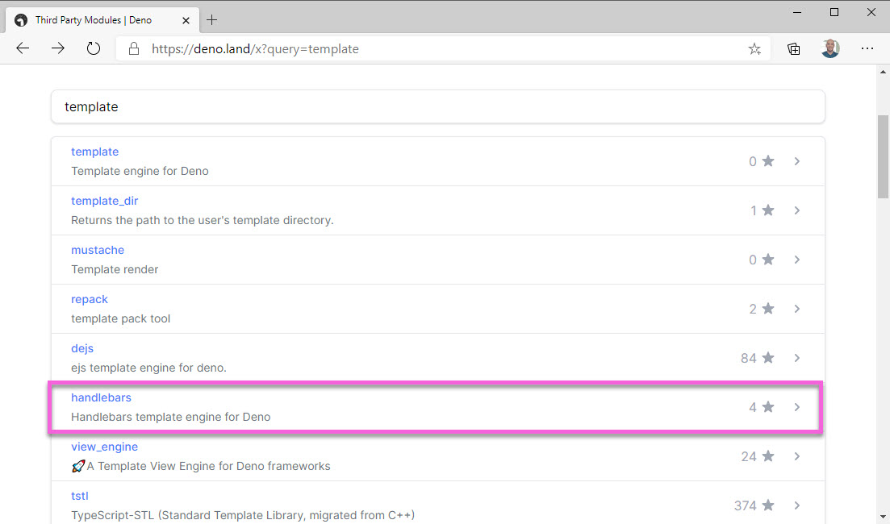
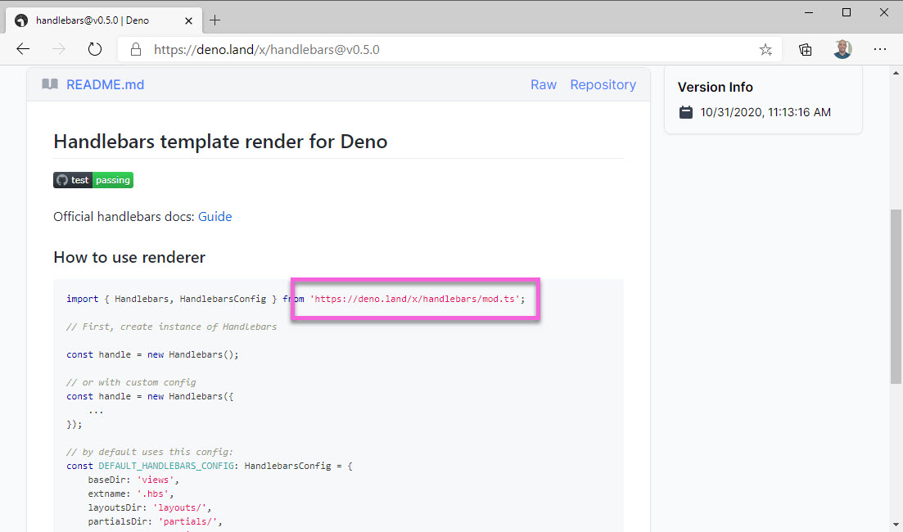
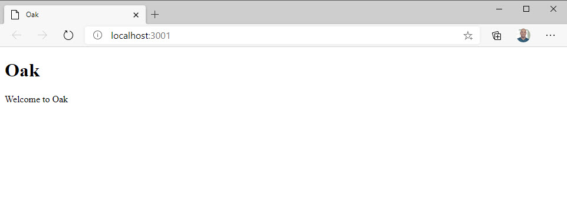

> Make sure you are on the "7-oak-templates" branch to follow along with this section.

A key benefit of web servers is being able to dynamically compose templates. In order to do that with Oak, we need to add a templating engine. In this section, we'll add the templating engine and change the router to render the template instead of just text.

## Finding a template engine

Deno has a surprising amount of third-part libraries to choose from given how new it is. If we [search Deno's third party registry](https://deno.land/x?query=template) for template libraries, we see there are quite a few to choose from. This includes some well known libraries like Mustache and Handlebars. Given that I usually opt for Handlebars with Express, we'll be using that one for this Oak project.



> Note that there are "view engines" for Deno. We won't be using any of those options in this workshop because I felt like they inject too much complexity into the conversation. Libraries like the "view_engine" project do provide some enhanced functionality, such as caching.

If you click on the "handlebars" option, you'll see the README which shows the URL that you'll need to import.



## Import Handlebars into the Oak project

First, we need to import the Handlebars library into our "deps.ts" file. Don't forget to export it at the bottom as well!

```typescript
import { Application, Router } from "https://deno.land/x/oak/mod.ts";
import { Handlebars } from "https://deno.land/x/handlebars/mod.ts";

export { Application, Router, Handlebars };
```

> I find it interesting that while Deno aims to avoid centralizing dependencies, it has effectively done so by creating this repository at deno.land/x. We may very well see npm again by another name.

To use the Handlebars library, we need to initialize an instance and pass in some configuration. To do this, we'll create a shared object that the routers can import and then use to return template rendered views. Even though we're importing a file that calles "new" multiple times, the same instance should be reused as it is cached by the runtime.

Let's create a root folder called "shared" and add an "hbs.ts" file inside. In that file, we'll need to import the Handlebars dependency from our "deps.ts" file.

```typescript
import { Handlebars } from "../deps.ts";
```

Create a new instance of the Handlebars class and pass in the following configuration object. Export the new instance.

```typescript
import { Handlebars } from "../deps.ts";

const handlebars = new Handlebars({
  baseDir: "views",
  extname: ".hbs",
  layoutsDir: "layouts/",
  partialsDir: "",
  defaultLayout: "main",
  helpers: undefined,
  compilerOptions: undefined,
});

export default handlebars;
```

These options are all the defaults with the exception of the empty string for the `partialsDir` option. This is because we won't be using partial views for this course and if we don't override the default value (`partials/`), a "file not found" error will be thrown by the Handlebars library.

Before we can actually use these templates, we need to create them. Create a new folder in the exercise project root called "views". First, we need a Layout. A Layout is the shell of the page. It is the main HTML page into which all of our other files will be rendered. Add a "layouts" folder to the "views" directory. Create a "main.hbs" file in the "views/layouts" directory, and add the following markup.

```html
<!DOCTYPE html>
<html lang="en">
  <head>
    <meta charset="UTF-8" />
    <meta name="viewport" content="width=device-width, initial-scale=1.0" />
    <title>Oak</title>
  </head>
  <body>
    {{{ body }}}
  </body>
</html>
```

This file serves as the main layout template. The `{{{ body }}}` is where we'll render different views depending on which URL is requested.

Now we need an "index" template to correspond with our "/" (index) route. We'll be passing in a "title" to the template from our code. Create an "index.hbs" file in the "views" folder and add the following markup.

```html
<h1>{{ title }}</h1>
<p>Welcome to {{ title }}</p>
```

This fragment will be rendered where the `{{{ body }}}` tag is in the "main.hbs" file.

Last, we need to render our templates and tell Oak to return them as the response. To do that, we first need to import the shared "hbs.ts" file into the "indexRoutes.ts" file.

```typescript
import { Router } from "../deps.ts";
import hbs from "../shared/hbs.ts";
```

Now, instead of returning text to the `ctx.response.body`, call the `hbs.renderView` method. You'll need to pass in the name of the template that you want to render (index) and any data that the template needs. In our case, it's just a "title" property.

```typescript
import { Router } from "../deps.ts";
import hbs from "../shared/hbs.ts";

export function use(path: string, router: Router) {
  router.get(`${path}`, async (ctx) => {
    ctx.response.body = await hbs.renderView("index", { title: "Oak" });
  });
}
```

Now run the application again and see what you get.



OK! Not super impressive to look at, but we're now handling routing and returning dynamic templates. The next thing we need to do is style this page with some CSS. To do that, we need to figure out how to get Oak to return static files from a directory in our project. That's exactly what we'll do in the next section.

**Bonus** - Create a "users" template and handle the view rendering in the "userRoutes.ts" file.
