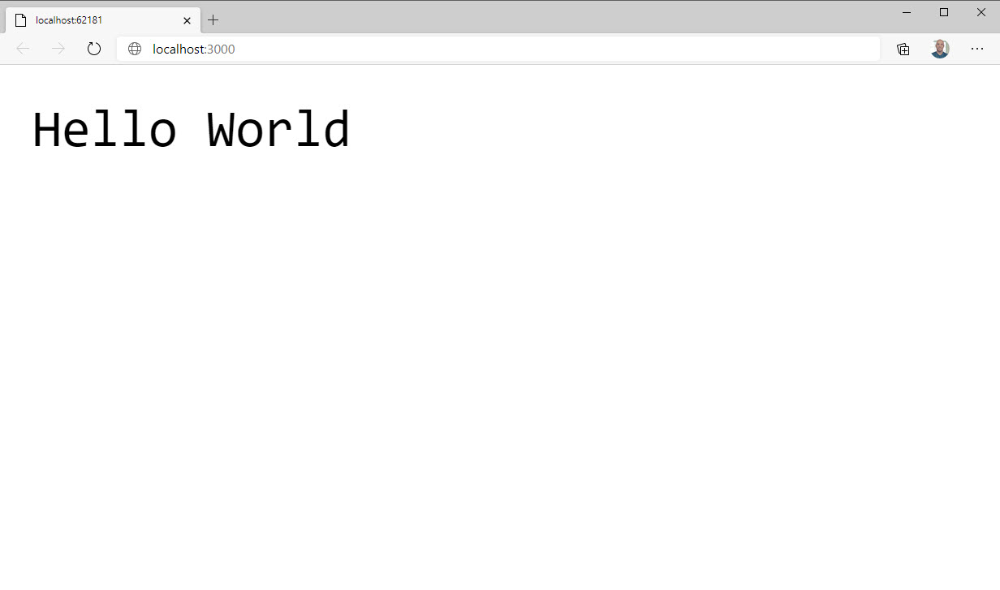

> Make sure you switch to the [7-simple-oak-server](https://github.com/burkeholland/deno-exercises/tree/7-oak-simple-server) branch to follow along with this section.

Oak is a [third-party library for Deno](https://oakserver.github.io/oak/). It's just like using an npm package with Node.

In the `app.ts` file, import the `Application` object from the Oak library...

```typescript
import { Application } from "https://deno.land/x/oak/mod.ts";
```

Create a new instance of both the `Application` class...

```typescript
import { Application } from "https://deno.land/x/oak/mod.ts";

const app = new Application();
```

Define a handler for the request. This is middleware.

```typescript
app.use((ctx, next) => {
  ctx.response.body = "Hello World";
});
```

Tell the app to listen on port 3000.

```typescript
import { Application } from "https://deno.land/x/oak/mod.ts";

const app = new Application();

app.use((ctx, next) => {
  ctx.response.body = "Hello World";
});

console.log(`Now listening on http://0.0.0.0:3000`);
app.listen("0.0.0.0:3000");
```

- Run the app with the `--allow-net`, `--unstable` and `--watch` flags.

```bash
deno run --allow-net --unstable app.ts
```

Visit the application in a browser window on port 3000.

> Note that if you didn't stop the previous application we built in the Web Server exercise, you may still have something running on port 3000. If that's the case, make sure you quit that process.



## Middleware

The `app.use` function is middleware. It is a function that lets you do things with the request. You can have as many of these as you want. they will execute in order. The `ctx` object contains the current server context. The `next` function must be called to notify Oak that this piece of middleware is done executing and it can move on to the next.

This is kind of abstract, so let's look at it in action.

Add another handler above the one which returns the body.

```typescript
import { Application } from "https://deno.land/x/oak/mod.ts";

const app = new Application();

app.use((ctx, next) => {
  console.log("This is middleware");
});

app.use((ctx, next) => {
  ctx.response.body = "Hello World";
});

console.log(`Now listening on http://0.0.0.0:3000`);
app.listen("0.0.0.0:3000");
```

Save the file and reload the browser window.

This time the terminal will log out "This is middleware". But the request never resolves. This is because Deno is waiting for you to call `next` so that it can run the _next_ piece of middleware, which sets the body of the response.

Modify the middleware with the log statement to call `next`.

```typescript
import { Application } from "https://deno.land/x/oak/mod.ts";

const app = new Application();

app.use((ctx, next) => {
  console.log("This is middleware");
  next();
});

app.use((ctx, next) => {
  ctx.response.body = "Hello World";
});

console.log(`Now listening on http://0.0.0.0:3000`);
app.listen("0.0.0.0:3000");
```

Save the file and refresh the browser.

This time, the terminal logs out the message and then the page is returned.

You can write pieces of middleware that can be passed to the `app.use` function. One of these pieces of middleware that we'll be using is the Deno router. In the next section we'll look at how to implement the router middleware for Deno.
