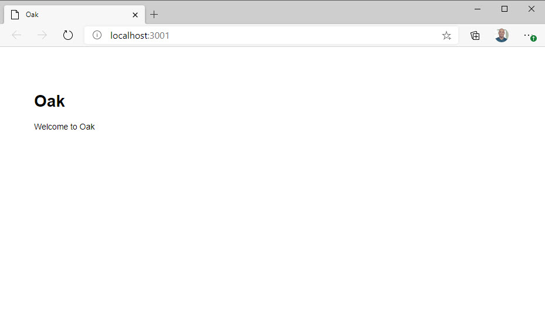

> Make sure you are on the "7-servering-static-files" branch to follow along with this section.

Serving up static files is arguably the most basic feature of a web server. For Oak, it's relatively easy to serve up static files without much ceremony.

For this project, we want to have a "public" directory and everything that goes in that folder should be accessible from our templates with the "/public" path.

For instance, if we were going to have a stylesheet that our "main.hbs" template references, we should be able to put it in a folder called "public/stylesheets" and then reference it like this in the "main.hbs" file...

```html
<link rel="stylesheet" href="public/stylesheets/style.css" />
```

First, let's create a "public" folder in the exercise project root. Inside of that, create a "stylesheets" folder. In that folder, add a "style.css" and add the following CSS...

```css
body {
  padding: 50px;
  font: 14px "Lucida Grande", Helvetica, Arial, sans-serif;
}
```

Now reference this stylesheet from the "main.hbs" file as shown in the first code snippet in this section...

```html
<!DOCTYPE html>
<html lang="en">
  <head>
    <meta charset="UTF-8" />
    <meta name="viewport" content="width=device-width, initial-scale=1.0" />
    <link rel="stylesheet" href="public/stylesheets/style.css" />
    <title>Oak</title>
  </head>
  <body>
    {{{ body }}}
  </body>
</html>
```

Oak contains a simple method for sending static files. It's called `send`. This method does exactly what it says - it "sends" a file from your local file system. First, we'll need to import `send` from "Oak" in our "deps.ts" file and then export it again at the bottom.

```typescript
import { Application, Router, send } from "https://deno.land/x/oak/mod.ts";
import { Handlebars } from "https://deno.land/x/handlebars/mod.ts";

export { Application, Router, send, Handlebars };
```

Now we need to create a route in the `app.ts` file to handle any requests to the "public" folder. We can write a route that goes to "/public". That will work for any file that is in the "public" directory, but the route won't trip when the route becomes "/public/stylesheets". We could create a route that is just "/public/stylesheets/:fileName". That would work. But it would only match files in the "public/stylesheets" directory. We could create multiple routes for any folder in the "public" directory. But that's going to clutter our `app.ts` with a lot of redundant routes. What we need is a wildcard route. How do we do that?

What we need to do is specify a "path" parameter that can be literally anything. We can do that like this...

```typescript
router.get("/public/:path", async (ctx) => {});
```

In order to get this route to fire for _any_ path underneath the "public" folder, we have to add a special designator to the `path` parameter. This is the "+" sign. The "+" is the wildcard. It says that this "path" parameter matches EVERYTHING that comes after "public". It doesn't matter if there are more "/" or not. All of that will get sucked into the "path" parameter.

```typescript
router.get("/public/:path+", async (ctx) => {});
```

Now we call the `send` method from Oak. We'll need to pass in the context - `ctx` - and the path to the file we want. Because we're passing a `path` parameter, we can just refer to that to get the path to the file. Note that we have to give an empty string option in case this parameter is undefined. TypeScript requires this.

```typescript
router.get("/public/:path+", async (ctx) => {
  await send(ctx, ctx.params.path || "");
});
```

If you run this, you'll get a 404. Why? You may have noticed that Deno doesn't spit out any errors to the terminal. Let's fix that by adding an error handler so we can see what's going on here.

## Adding a global error handler

The `app` object we're working with in "app.ts" has an `addEventListener` method where we can listen for a generic error event. We could then just log out the `err` object to the console...

app.addEventListener("error", err => {
console.log(err);
});

This should show you a stack trace with an error message telling you...

```
ApplicationErrorEvent {
  bubbles: false,
  cancelable: false,
  composed: false,
  currentTarget: EventTarget { handle: [AsyncFunction], proxy: false, state: {} },
  defaultPrevented: false,
  eventPhase: 2,
  target: EventTarget { handle: [AsyncFunction], proxy: false, state: {} },
  timeStamp: 1605888293829,
  type: "error",
  message: "No such file or directory (os error 2)",
  filename: "",
  lineno: 0,
  colno: 0,
  error: NotFoundError: No such file or directory (os error 2)
    at createHttpError (httpError.ts:131:10)
    at send (send.ts:148:13)
    at async app.ts:13:5
    at async dispatch (middleware.ts:41:7)
    at async dispatch (middleware.ts:41:7)
    at async dispatch (middleware.ts:41:7)
    at async Application.#handleRequest (application.ts:252:9)
}
```

The key here is "no such file or directory". This means that it can't find the file that we're looking for. Why? The reason is that we have only provided a relative path. In order for Deno to find this file, we need to pass the full path on the system. To do that, we can pass an options object as a third parameter on the `send` function. That object has a property called "root". This is where we need to specify the path of the root directory - or the directory that we're currently in. You may remember from earlier in this course that the `Deno` object has a `cwd` method which will return the current working directory. We then need to append `public` on the root since the "path" parameter won't contain this part of the path to the requested file.

```typescript
router.get("/public/:path+", async (ctx) => {
  await send(ctx, ctx.params.path || "", {
    root: `${Deno.cwd()}/public`,
  });
});
```

This looks kind of hacky. We're specifying the "public" string twice and we've got to handle an empty string with an `||`. There is a better way to write this.

The `ctx` object contains a `request` object. On that object, you'll find a `url` object that has a `pathname` property. That `pathname` is going to contain the full path requested - which is `public/stylesheets/style.css`. Which is exactly what we want. Don't be afraid to explore these objects using the debugger to find better solutions, even though it might seem obvious to use the "path" parameter.

So we can finally re-write this just so...

```typescript
router.get("/public/:path+", async (ctx) => {
  await send(ctx, ctx.request.url.pathname, {
    root: Deno.cwd(),
  });
});
```

Run the program again. This time, the file is served up from the "public/stylesheets" directory. Now, we can add any static assets we want, including additional JavaScript files for the frontend, images, or anything else that we'd like to send.



**Bonus** - Instead of logging an error, return the error via a view IF and only if the application is run with the DEVELOPMENT environment variable.
