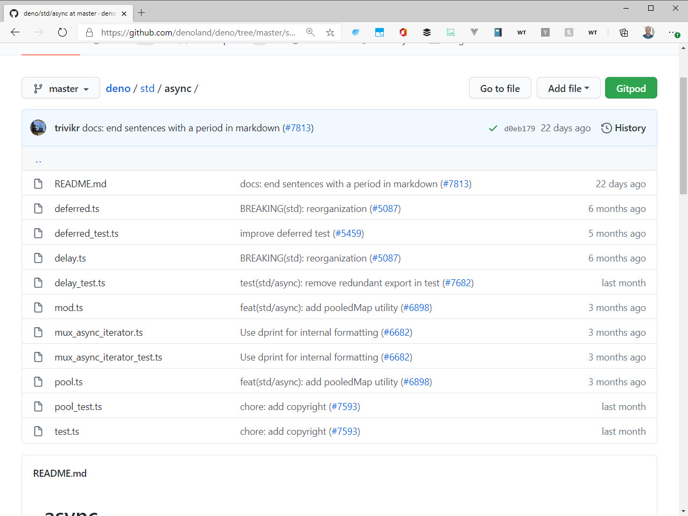
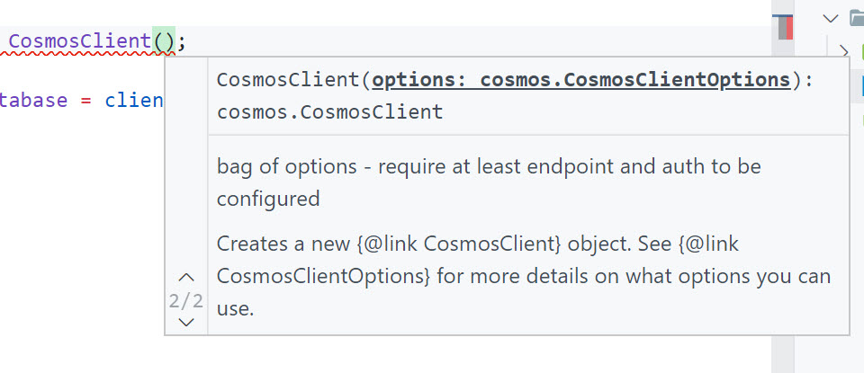
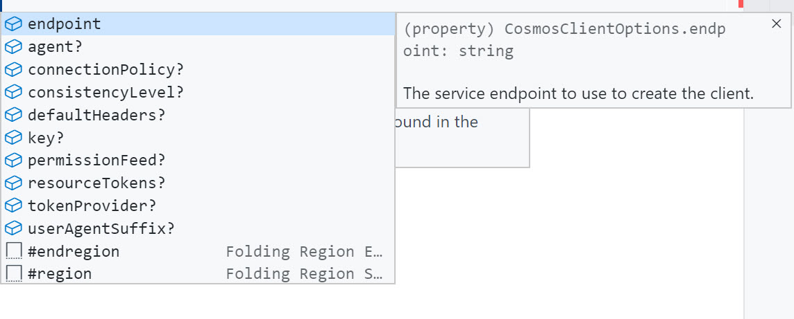

Deno supports TypeScript as a first-class citizen. In fact, if you look at the Deno project, you'll see that it's standard library is written in TypeScript.



The TypeScript compiler is part of the runtime, and there is no need to transpile to JavaScript before you run a file.

This may seem more like a feature than a core principal, but according to his talk, Ryan feels that dynamic languages like JavaScript and Python are very good for prototyping and scientific computing - running small batches of code to do some isolated processing. Complex systems, on the other hand, need a structured language with a type system.

You may not agree with that, and that's ok. I don't know that I necessarily do myself. However, there are some key reasons to consider TypeScript as the preferred language for larger, more complex systems and applications.

## Structure and standardization

One of the beatiful things about JavaScript is that there is no _right_ way to do it. Everyone organizes their projects differently. Some people use classes and some don't. Some people use objects to store collections and some people use arrays. If you remember the book - The Lorax - JavaScript is like a thneed. It is whatever you need it to be.

This is also one of the drawbacks. It makes it harder for organizations to standardize on JavaScript because they have to invent their own patterns.

Strongly typed languages OO languages, by contrast, have a genuinely accepted set of patterns as laid out by books such as those laid out in the book "Design Patterns" by the notorious Gang of Four. By the way, one of those authors, Erich Gamma is the man behind VS Code. So these folks know what they are doing.

## Better Tooling

VS Code provides some legit tooling for JavaScript. It's quite good and provides some things that VS Code simply cannot do with JavaScript.

Make a new folder and initialize a new project with "npm init". Add an empty file called "index.ts".

Install the Cosmos DB package from npm. We won't be doing anything with it, but it's a great example of what benefits you can get when you adopt TypeScript as your language...

```bash
npm i @azure/cosmos
```

Import the module and create a new instance of "CosmosClient"...

```bash
import cosmos from "@azure/cosmos";

const client = new cosmos.CosmosClient("");
```

Notice that when you open the parens on "CosmosClient", VS Code suggests the parameter and parameter types. It also shows that this constructor is overloaded. That means that you can pass different numbers or types of parameters to initialize the object. One is initialized with a string, and the other is initialized as an object.



Even better, TypeScript knows what options go in that object, what their types are, and whether or not they are required.



Selecting an option in the intellisense tells you what it's type is and the ? on the end tells you if it's required or not.

These are the kinds of things that you want in an API as a developer. Plainly put, when you're writing code, it's much easier to write JavaScript. But when you're consuming someone else's code, it's much easier if it was written in TypeScript. This is why TypeScript is great for large projects with a lot of different developers.

Note that you can get the same effect in JavaScript by including TypeScript definitions for your JavaScript. This is why you get such great tooling on a library like axios - this is the TypeScript definitions kicking in.

## Benefits of Being First-Class

The benefits of TypeScript being first-class is that you don't need a transpilation step. The following code won't work in Node, because it doesn't recognize the specifics of TypeScript...

```bash
const message: string = "Hello";

console.log(message);
```

> Note that Node WILL execute any file regardless of the extension. If the file contains valid JavaScript, it will work. You can try this out by putting some JavaScript in a file called index.smurf and then running it with node index.smurf

In order to get TypeScript to work in Node, you have to convert it to JavaScript first. This is not hard to do in VS Code, but it creates a .js file of the same name. So now you have two files.

This leads to a fairly cluttered project directory, especially if you are also generating source maps. Then you have 3 files.

We often mitigate this in VS Code with the setting "files.exclude" and then using globs to hide the ".js" and ".js.map" files...

```json
"files.exclude": {
    "**/*{.js,.js.map}": true,
}
```

This has the side-effect of hiding the actual code files though. And furthermore, you need a watch process to make sure the underlying JavaScript is up to date. If you get out of date, you can spend a lot of time trying to figure out why something isn't working and it's because your watch process stopped running or some other error.

Furthermore, when you deploy this app, the TypeScript needs to be built into JavaScript and then you don't need the TypeScript anymore and don't really want it on your production server. So what we often do is specify an output directy for the JavaScript and now we've got our project split into source and build directories. Now, that's not a bad thing. That might actually be the way things _should_ be, but it's a drag to set it up and easy to mess it up.

When TypeScript is a first-class citizen, none of this hackiness that comes from transpilation happens. Your TypeScript files ARE your code files. In Deno, TypeScript is a first-class citizen.
