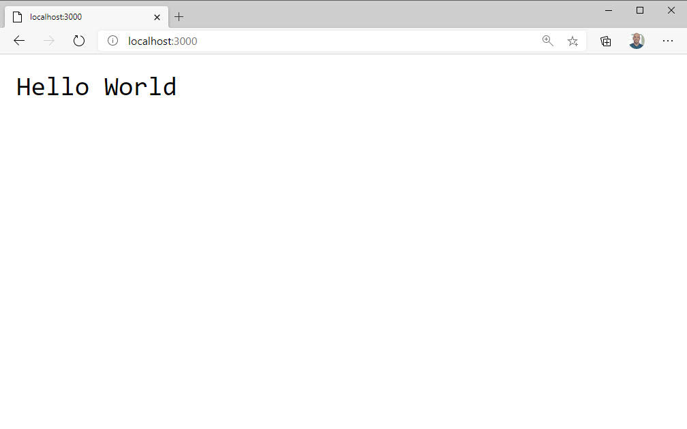

> Make sure you are on the "6-building-a-simple-webserver" branch to follow along with this section.

One of the most common use-cases for a JavaScript runtime is a web server. Web servers are a common way of exposing APIs and building fullstack data-driven applications.

The Deno standard library contains a `server` module that lets you implement in a web server in just a few lines of code.

first, import the `server` module from the Deno standard library into the "app.ts" file.

```typescript
import { serve } from "https://deno.land/std/http/server.ts";
```

Next, we'll, define `HOSTNAME` and `PORT` constants. For the `HOSTNAME`, we'll use 0.0.0.0, which is the same as saying "localhost" or "127.0.0.1", but is more compatible with things like Docker.

```typescript
import { serve } from "https://deno.land/std/http/server.ts";
const PORT = 3000;
const HOSTNAME = "0.0.0.0";
```

The only thing you need from the `server` library is the `serve` function. All you need to do is call that function and pass in the hostname and port to get a new server instance.

```typescript
import { serve } from "https://deno.land/std/http/server.ts";

const PORT = 3000;
const HOSTNAME = "0.0.0.0";

const server = serve({ hostname: HOSTNAME, port: PORT });
```

The server is now started and listening. But it doesn't do anything because we aren't handling any requests. As awkward as this may seem, we're going to run an infinite `for` loop and handle any request that comes in by setting the `respond` property on the request.

Use a `for` loop to start the server and listen for any incoming request. The body contains a simple response of "Hello World".

```typescript
import { serve } from "https://deno.land/std/http/server.ts";

const PORT = 3000;
const HOSTNAME = "0.0.0.0";

const server = serve({ hostname: HOSTNAME, port: PORT });

console.log(`Server is now running on: http://${HOSTNAME}:${PORT}`);

for await (const req of server) {
  req.respond({
    body: "Hello World",
  });
}
```

Run the program with `deno run app.ts`. It should tell you that permission is denied and that the `allow-net` flag is required.

```bash
Check file:///home/burkeholland/dev/deno-first-look-exercises/app.ts
error: Uncaught PermissionDenied: network access to "0.0.0.0:3000", run again with the --allow-net flag
```

Run the program again with the `allow-net` flag. Be sure to restrict the access to only port 3000.

```bash
deno run --allow-net=0.0.0.0:3000 app.ts
```

The server should now be running on port 3000. When you visit it in the browser, you should see "Hello World".



## Returning HTML

Returning text isn't terribly useful, so instead, return some HTML.

```app.ts
for await (const req of server) {
    req.respond({
      body: "<h1>Hello World</h1>",
    });
}
```

OK - that's about as simple a web server as we can get. Let's take a look at some common web server type scenarios.
