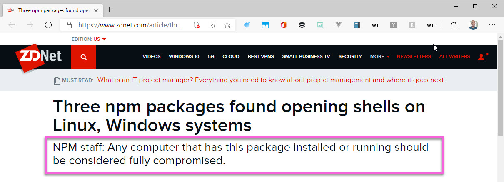

> Switch to the "2-secure-by-default" branch in the exercises to run the code in this section

Deno is secure by default. When I hear things like this, they often come off to me as esoteric and frankly paranoid reasons to write an entirely new runtime. The truth is, though, that Node.js is not a secure runtime environment. When you run a Node program on your local machine, it has all the permissions that you do. If you have the write to access a file, so does that program. And most of us as developers are have root or admin access on our own machines. Even if we don't, it would be fairly easy for an npm module with bad intentions to do some nasty damage to your machine, or worse, your production environment.

The browser is not like this. The browser is a secure sandbox that has zero access to your machine unless you grant it. Your phone is the same way. Think about it. Can apps on your phone access your location without your permission? Can they access your files and photos? No. You have to explicitly grant them the rights to do this.

Similarly, the browser needs rights to access you location or camera, or even permission to send you a notification.

But look at how this plays out in Node...

The Node fs module lets you read and write to the file system. This means that you can pretty easily read sensitive information with the "fs" module - maybe something like this:

```javascript
const fs = require("fs").promises;
const path = require("path");
const homedir = require("os").homedir();

async function findEnvFiles(folderName, envFiles) {
  // read all the items in the current folder
  const items = await fs.readdir(folderName, { withFileTypes: true });

  // iterate over each found item
  for (item of items) {
    // if the item is a directory, it will need to be searched
    if (item.isDirectory()) {
      // call this method recursively, appending the folder name to make a new path
      await findEnvFiles(path.join(folderName, item.name), envFiles);
    } else {
      // Make sure the discovered file is a .env file
      if (item.name === ".env" || item.name.indexOf(".env.") > -1) {
        // store the file path in the envFiles array
        envFiles.push(path.join(folderName, item.name));
      }
    }
  }
}

async function readSecrets(envFiles) {
  let allSecrets = [];
  for (file of envFiles) {
    const secrets = await (await fs.readFile(file)).toString();
    allSecrets.push(secrets);
  }
  return allSecrets;
}

async function main() {
  const envFiles = [];
  await findEnvFiles(homedir, envFiles);

  const secrets = await readSecrets(envFiles);

  secrets.forEach((secret) => {
    console.log(secret);
  });
}

main();
```

This code recursively reads your home directory for anything that looks like an .env file, and then logs that out. That's all your secrets, connection strings, etc. If I can get you to run this, then I can get your database connection strings, your OAuth keys - whatever you might be keeping in those local .env files.

But how do I get you to run this? Aren't you smart enough NOT to run some package you don't trust or code that just looks nefarious? After all, YOU have to run this. So how do I get you to run it?

The open-source world is such a wonderful place in which nobody would ever take advantage of you, right? Fortunately, that is by and large true, but by definition, open-source is open. Anyone can publish a module to npm. There is no review process. There is no security scan that occurs. Publish to npm and that module is immediately live for anyone to consume. So I could stick that code into an npm module and immediately make it available for anyone. But again, how do I get you to install and run this module?

In his talk entitled, "How to hack a Node.js app", Asim Houssain details the extent to which the Node ecosystem is routinely used to exploit, hijack and otherwise maliciously execute code on unsuspecting machines.

<iframe width="560" height="315" src="https://www.youtube.com/embed/xb6yyztEe_A" frameborder="0" allow="accelerometer; autoplay; clipboard-write; encrypted-media; gyroscope; picture-in-picture" allowfullscreen></iframe>

In this talk, he mentions many different ways that exploits can be done. But one of the most common and malicious is so simple that it's disappointing.

### Typo Squatting

Typo squatting is when a package names itself in a commonly mistyped form of a legitimate module. In his talk, Wassim gives the example of the "crossenv" package. The "crossenv" package is a commonly used utility that normalizes the passing in of command line flags across Windows and Linux. It is widely used. Someone figured out that people commonly try to install "cross-env" instead of "crossenv" because they aren't sure what the exact name of the package is. One of those packages normalizes how programs are launched, the other reads your .env files - you know - where all your secrets and keys are stored and sends them to a remote server. WHICH IS EXACTLY WHAT THE CODE ABOVE DOES.

Now that's pretty bad, but it can get much, much worse.

In preparing for this course, I ran across a headline from zdnet...



"You should consider your entire system compromised".

That's heavy. And it can happen to anyone. And if you read that article, it says that even uninstalling the module doesn't mean you are safe. Because who knows what these packages installed and ran in the background?

Node.js is simply not a safe runtime. It is wide open and is based on a wide open package system. While that makes is super convenient to use, it is by definition also relatively easy for seriously bad things to happen to your programs, even when you are paying close attention. There is a direct trade-off between convenience and security. Node has optimized for convenience.

Deno is secure by default. That means that by default, programs have no access to read your file system, make an http call or perform other I/O related activities on your machine. You have to explicitly grant it access. We'll see how this works when we get into the syntax of Deno. You'll also get to see this tradeoff of convenience in action and decide for yourself whether or not "secure by default" should in fact be the default.

Now this doesn't guarantee that you will be safe, but it makes it much harder for you to be victimized. It starts from a position of safety, and then asks you to opt out of that. Secure by default.
