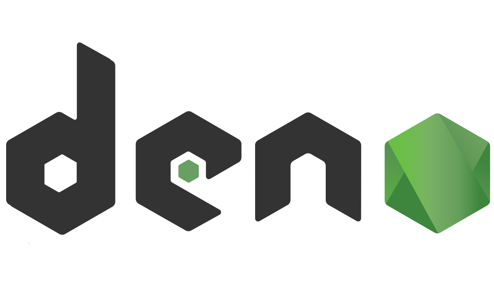

Deno is a command-line runtime for JavaScript. This means that it allows JavaScript to run outside of the browser. This is often referred to as "JavaScript on the server". This allows JavaScript to do I/O type of things like reading and writing to files on disk, or handling incoming requests and working with streams of data. Basically, the runtime frees JavaScript from the browser and promotes it to a first-class language like C# or Java.

If you've been writing JavaScript for a while, you are probably familiar with an existing runtime that already does this, called, "Node".

"Deno" is an anagram for Node. It is literally the letters in "Node" rearranged to make a different word. This is not an inconsequential detail. If you were going to build a completely new runtime for JavaScript, why would you use the name Node, and just mix up the letters? If it's not Node, then why not call it something entirely different?

In order to understand this, we need to first address a different question, which is why, oh why, do we need yet another runtime environment?

## Why Oh Why Do We Need Deno?

If you've been in technology for any amount of time, you know that things move quickly. Nowhere do they move more quickly than in the world of JavaScript. It seems like we have a new library or framework every month. Yesterday's best practices are today's anti-patterns. It can be incredibly frustrating to try and build a profession in such churn.

My gut reaction to hearing about Deno was "please no". We already have Node. I know Node. Node powers not just my apps, but also my development environment. It powers the tools that I use to build applications. npm is a critical part of virtually any JavaScript project and if you don't believe that, just look at it's [recent acquisition by GitHub](https://github.blog/2020-03-16-npm-is-joining-github/). I'm open to new ideas, but if we're going to do it, they need to solve major problems and provide some enormous benefits over what I'm doing right now. Because constant switching to the latest and "best" technology is a great way to accrue massive amounts of technical debt.

Deno was created by Ryan Dahl. Ryan is the same person who created Node. Ryan points out that when he initially created Node, he was primarily concerned with I/O operations. To be even more specific, he bemoaned Apache HTTP Server, which was the most popular web server at the time. Specifically, the fact that Apache struggled with large numbers of concurrent connections. Also the fact that the prominent paradigm for web server code at the time was code that was executed from top to bottom in order. If any operation along the way took a long time, the rest of the code would be blocked from executing and this affected performance. All to say that when Ryan created Node, he did it to create a highly performant way of handling http requests.

And he accomplished that goal. In 2012, Ryan left the project because he considered it mostly "done". Fast forward to today, and we know that Node has changed significantly since 2012. It's also given Ryan a lot of time to reflect and there are many things that he regrets now about Node.

In his talk "10 things I regret about Node", Ryan looks back with 20/20 hindsight on some of the things in Node that he wishes were don't differently.

<iframe width="560" height="315" src="https://www.youtube.com/embed/M3BM9TB-8yA" frameborder="0" allow="accelerometer; autoplay; clipboard-write; encrypted-media; gyroscope; picture-in-picture" allowfullscreen></iframe>

Now, no software is perfect. JavaScript is not perfect. PHP is not perfect. Java is not perfect. There are always things that we do, decisions that we make where we are prognosticating about the future. We don't really know how things will play out when we write code, and we try and make the best decisions with the information we have. Living with regret is not typically a healthy thing, and hindsight is always 20/20. But Ryan's Node regrets are important in this context, because they lay the foundation for why Deno exists.

Deno is Ryan's second attempt at creating a command-line runtime for JavaScript based on the mistakes that he feels like he made when he built Node. That's why it's an anagram. It is intentionally meant by Ryan to be a perfection of the ideas of Node, while fixing what he considers major flaws that are baked into the foundation of Node. It's important to understand what those regrets are, because the oddities of Deno will make much more sense.
